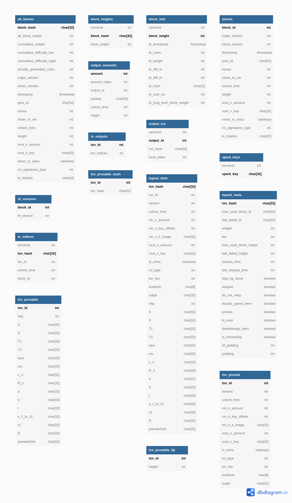

<h1 align="center">
  <a href="https://github.com/AnonimaUzanto/py-monerodb">
    
  </a>
</h1>

<div align="center">
  Python Monero Database Reader
  <br />
  <br />
  <a href="https://github.com/AnonimaUzanto/py-monerodb/issues/new?assignees=&labels=bug&template=01_BUG_REPORT.md&title=bug%3A+">Report a Bug</a>
  ·
  <a href="https://github.com/AnonimaUzanto/py-monerodb/issues/new?assignees=&labels=enhancement&template=02_FEATURE_REQUEST.md&title=feat%3A+">Request a Feature</a>
  ·
  <a href="https://github.com/AnonimaUzanto/py-monerodb/discussions">Ask a Question</a>
</div>

<div align="center">
<br />

[](LICENSE)

[](https://github.com/AnonimaUzanto/py-monerodb/issues?q=is%3Aissue+is%3Aopen+label%3A%22help+wanted%22)
[](https://github.com/AnonimaUzanto)

</div>

<details open="open">
<summary>Table of Contents</summary>

- [About](#about)
  - [Built With](#built-with)
- [Getting Started](#getting-started)
  - [Prerequisites](#prerequisites)
  - [Installation](#installation)
- [Usage](#usage)
- [Roadmap](#roadmap)
- [Support](#support)
- [Project assistance](#project-assistance)
- [Contributing](#contributing)
- [Authors & contributors](#authors--contributors)
- [Security](#security)
- [License](#license)
- [Acknowledgements](#acknowledgements)

</details>

---

## About

This project is intended to create a Monero database reader that is entirely independent of core Monero code. 
This will allow independent validation of the byte data available to any interested party.

The Monero database is stored in a [Lightning Memory-Mapped Database](http://www.lmdb.tech/doc/) (LMDB). 
The database is stored in a file named `data.mdb` that contains 16 named databases. Named databases in LMDB
are similar to tables in relational database. The tables in the Monero database are described as follows:

<div align="center">

| Table             | Key        | Data                                 |
|-------------------|------------|--------------------------------------|
| alt_blocks        | block hash | {block data, block blob}             |
| block_heights     | block hash | block height                         |
| block_info        | block ID   | {block metadata}                     |
| blocks            | block ID   | block blob                           |
| hf_versions       | block ID   | int: blockchain version              |
| output_amounts    | amount     | [{amount output index, metadata}...] |
| output_txs        | output ID  | {txn hash, local index}              |
| spent_keys        | input hash | -                                    |
| tx_indices        | txn hash   | {txn ID, metadata}                   |
| tx_outputs        | txn ID     | [txn amount output indices]          |
| txpool_blob       | txn hash   | txn blob                             |
| txpool_meta       | txn hash   | txn metadata                         |
| txs_prunable      | txn ID     | prunable txn blob                    |
| txs_prunable_hash | txn ID     | prunable txn hash                    |
| txs_prunable_tip  | txn ID     | height                               |
| txs_pruned        | txn ID     | pruned txn blob                      |
| properties        |            | *database metadata*                  |
| txs               |            | *empty database*                     |
| circ_supply       |            | *Haven specific table*               |
| circ_supply_tally |            | *Haven specific table*               |
| output_types      |            | *Haven specific table*               |

</div>

&nbsp;  
LMDB databases store key:value pairs of bytestrings. Most tables use a standard key:value pair where the
key is the actual key used to look up the corresponding value. In some tables the key is uniformly 8 bytes of
zeros while the pseudokey is the first 8 or 32 bytes of the value. In these instances the table structure is more
accurately represented as zero_key:pseudokey|value. As an example, in the `block_info` table all of the keys are 
8 bytes of zeros and the values are block height as the pseudokey and then block info as the value. This functionality
corresponds to the `dupsort` and `dupfixed` database flags being set to True in the LMDB database.

<div align="center">

| Table             | integerkey | dupsort | dupfixed | integerdup | reverse_key |
|-------------------|------------|---------|----------|------------|-------------|
| alt_blocks        | False      | False   | False    | False      | False       |
| block_heights     | True       | True    | True     | False      | False       |
| block_info        | True       | True    | True     | False      | False       |
| blocks            | True       | False   | False    | False      | False       |
| hf_versions       | True       | False   | False    | False      | False       |
| output_amounts    | True       | True    | True     | False      | False       |
| output_txs        | True       | True    | True     | False      | False       |
| properties        | False      | False   | False    | False      | False       |
| spent_keys        | True       | True    | True     | False      | False       |
| tx_indices        | True       | True    | True     | False      | False       |
| tx_outputs        | True       | False   | False    | False      | False       |
| txpool_blob       | False      | False   | False    | False      | False       |
| txpool_meta       | False      | False   | False    | False      | False       |
| txs               | True       | False   | False    | False      | False       |
| txs_prunable      | True       | False   | False    | False      | False       |
| txs_prunable_hash | True       | True    | True     | False      | False       |
| txs_prunable_tip  | True       | True    | True     | False      | False       |
| txs_pruned        | True       | False   | False    | False      | False       |
</div>

<br />

The LMDB database is not a relational database, so it is not stricly accurate to present it as such. However, the way 
the database is used by Monero does roughly translate to a relational database. The following diagram shows all Monero
tables with an approximation of a primary key for each table.

<br />

<div align="center">
  
  </br>  
  Created with <a href="https://dbdiagram.io/home">dbdiagram</a>
</div>


# Getting Started

### Prerequisites

This project requires a modified version of the package `py-lmdb`. In some tables Monero uses pseudo keys 
(32 byte hash, 8 byte integer) that require modified comparison functionality that is included in a forked
version of the `py-lmdb` package.

```
git clone https://github.com/AnonimalUzanto/py-lmdb
pip install -e ./py-lmdb
```
### Installation

1. Clone the repo
```
git clone https://github.com/AnonimalUzanto/py-monerodb
```
2. Edit the constant `DATABASE_DIRECTORY` in the file `constants.py` to reflect the path to `data.mdb`.
3. Install the package
```python
pip install -e ./py-monerodb
```

## Usage

1. Import the package and instantiate a Monero class
```python
from pymonerodb import MoneroDB
from pymonerodb.utils.readers import pretty_print

monerodb = MoneroDB()
block = monerodb.get_block(2595691)
pretty_print(block)
```

## To Do

1. Document the byte structure of each table
2. Confirm decoded bytes equal total bytes
4. Determine which LMDB tables are deprecated
5. Modify code to work with all historic versions of data
6. Create tests to validate code
7. Identify the sequence of database reads occurring when validating a transaction
8. Identify the sequence of database writes occurring during a new transaction

## Roadmap

See the [open issues](https://github.com/AnonimaUzanto/py-monerodb/issues) for a list of proposed features (and known issues).

- [Top Feature Requests](https://github.com/AnonimaUzanto/py-monerodb/issues?q=label%3Aenhancement+is%3Aopen+sort%3Areactions-%2B1-desc) (Add your votes using the 👍 reaction)
- [Top Bugs](https://github.com/AnonimaUzanto/py-monerodb/issues?q=is%3Aissue+is%3Aopen+label%3Abug+sort%3Areactions-%2B1-desc) (Add your votes using the 👍 reaction)
- [Newest Bugs](https://github.com/AnonimaUzanto/py-monerodb/issues?q=is%3Aopen+is%3Aissue+label%3Abug)

## Support

Reach out to the maintainer at one of the following places:

- [GitHub Discussions](https://github.com/AnonimaUzanto/py-monerodb/discussions)
- Contact options listed on [this GitHub profile](https://github.com/AnonimaUzanto)

## Project assistance

If you want to say **thank you** or/and support active development of Python Monero Database Reader:

- Add a [GitHub Star](https://github.com/AnonimaUzanto/py-monerodb) to the project.
- Tweet about the Python Monero Database Reader.
- Write interesting articles about the project on [Dev.to](https://dev.to/), [Medium](https://medium.com/) or your personal blog.

Together, we can make Python Monero Database Reader **better**!

## Contributing

First off, thanks for taking the time to contribute! Contributions are what make the open-source community such an amazing place to learn, inspire, and create. Any contributions you make will benefit everybody else and are **greatly appreciated**.


Please read [our contribution guidelines](docs/CONTRIBUTING.md), and thank you for being involved!

## Authors & contributors

The original setup of this repository is by [AnonimaUzanto](https://github.com/AnonimaUzanto).

For a full list of all authors and contributors, see [the contributors page](https://github.com/AnonimaUzanto/py-monerodb/contributors).

## Security

Python Monero Database Reader follows good practices of security, but 100% security cannot be assured.
Python Monero Database Reader is provided **"as is"** without any **warranty**. Use at your own risk.

_For more information and to report security issues, please refer to our [security documentation](docs/SECURITY.md)._

## License

This project is licensed under the **MIT license**.

See [LICENSE](LICENSE) for more information.

## Acknowledgements

[Monero Core Team](https://github.com/monero-project/monero)  
[Python LMDB binding team](https://github.com/jnwatson/py-lmdb/)  
[Monero LMDB binding modifications team](https://github.com/normoes/py-lmdb/)  
